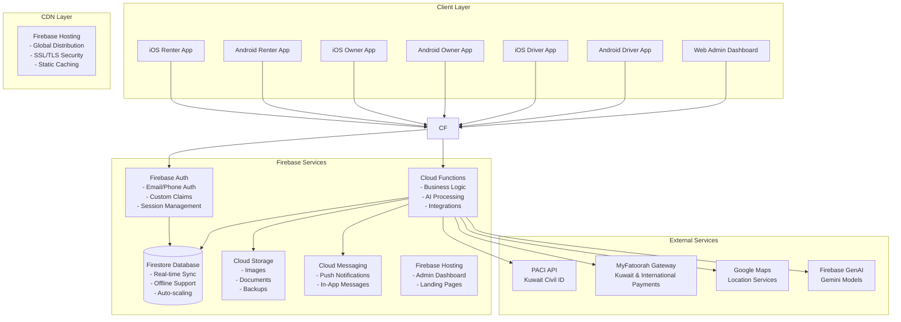
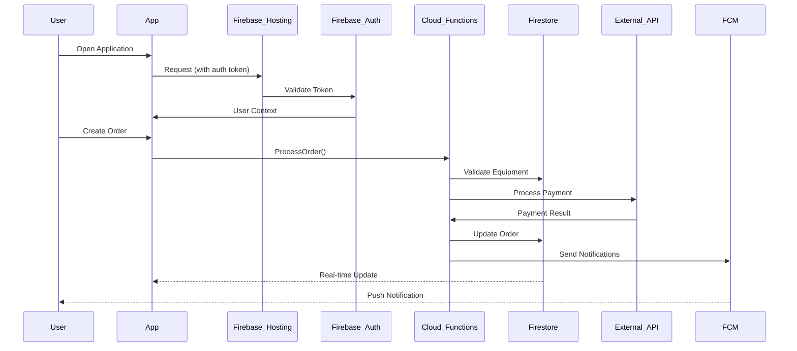

# YARDR - System Architecture

## High-Level Architecture

## Data Flow Architecture

## Architecture Components

### Client Layer

#### Mobile Applications
- **iOS Renter App**: Native iOS app for equipment renters
- **Android Renter App**: Native Android app for equipment renters
- **iOS Owner App**: Native iOS app for equipment owners
- **Android Owner App**: Native Android app for equipment owners
- **iOS Driver App**: Native iOS app for drivers
- **Android Driver App**: Native Android app for drivers

#### Web Application
- **Admin Dashboard**: Web-based admin interface using Next.js and ShadCN

### CDN Layer

#### Firebase Hosting
- **Global Distribution**: Content delivery across multiple regions
- **SSL/TLS Security**: Automatic HTTPS and security headers
- **Static Caching**: Optimized delivery of static assets
- **SSL/TLS**: Secure connections with automatic certificate management

### Firebase Services

#### Authentication
- **Multi-provider Support**: Email/password and phone authentication
- **Custom Claims**: Role-based access control
- **Session Management**: Secure token handling and refresh

#### Firestore Database
- **Real-time Sync**: Live data updates across all clients
- **Offline Support**: Local data persistence and sync
- **Auto-scaling**: Automatic scaling based on demand
- **Security Rules**: Fine-grained access control

#### Cloud Functions
- **Business Logic**: Server-side processing
- **AI Processing**: Natural language processing for equipment recommendations
- **Integrations**: Third-party service integrations
- **Event Triggers**: Automated responses to database changes

#### Cloud Storage
- **File Management**: Images, documents, and backups
- **Access Control**: Secure file access with signed URLs
- **CDN Integration**: Optimized file delivery

#### Cloud Messaging
- **Push Notifications**: Real-time notifications to mobile devices
- **In-App Messages**: Contextual messaging within applications
- **Topic Subscriptions**: Targeted messaging by user roles

#### Firebase Hosting
- **Admin Dashboard**: Hosting for web admin interface
- **Landing Pages**: Marketing and informational pages
- **Custom Domains**: Branded URLs and SSL certificates

### External Services

#### PACI API
- **Kuwait Civil ID Verification**: Government identity verification
- **Data Validation**: Official identity data validation
- **Compliance**: Meeting local regulatory requirements

#### MyFatoorah Gateway
- **Kuwait & International Payments**: Local and international payment processing
- **Multiple Payment Methods**: Cards, bank transfers, digital wallets
- **Mobile Payments**: Apple Pay, Google Pay integration
- **Currency Support**: Kuwaiti Dinar (KWD) and international currencies
- **Multi-currency**: Support for various currencies
- **Payment Methods**: Credit/debit cards and digital wallets

#### Google Maps
- **Location Services**: GPS and mapping functionality
- **Geocoding**: Address to coordinates conversion
- **Directions**: Route planning and navigation
- **Places API**: Location search and details

#### Firebase GenAI Chatbot
- **Gemini Models**: Advanced AI using Google's Gemini models
- **Natural Language Processing**: Understanding user requests with context awareness
- **Equipment Matching**: AI-powered equipment recommendations
- **Multi-language**: English and Arabic language support
- **Firestore Integration**: Seamless conversation storage and retrieval

