# YARDR - Complete User Experience Flows

## Table of Contents
1. [Complete Renter Journey](#complete-renter-journey)
2. [Complete Owner Journey](#complete-owner-journey)
3. [Complete Driver Journey](#complete-driver-journey)
4. [Complete Admin Journey](#complete-admin-journey)
5. [App Navigation Flows](#app-navigation-flows)
6. [Settings & Profile Management](#settings--profile-management)
7. [Notification System](#notification-system)
8. [Help & Support System](#help--support-system)
9. [Error Handling & Edge Cases](#error-handling--edge-cases)
10. [Offline Capabilities](#offline-capabilities)
11. [Key User Flow Patterns](#key-user-flow-patterns)
12. [User Experience Considerations](#user-experience-considerations)
13. [Success Metrics](#success-metrics)

## Complete Renter Journey

```mermaid
flowchart TD
    Start([User Opens App]) --> FirstTime{First Time?}
    
    FirstTime -->|Yes| Onboarding[Onboarding Screens]
    FirstTime -->|No| AuthCheck{Authenticated?}
    
    Onboarding --> Registration[Registration]
    Registration --> PhoneVerify[Phone Verification]
    PhoneVerify --> ProfileSetup[Profile Setup]
    ProfileSetup --> PACIOption{PACI Verification?}
    
    PACIOption -->|Yes| PACIFlow[PACI Verification Flow]
    PACIOption -->|No| BasicUser[Basic User Status]
    
    PACIFlow --> TrustedUser[Trusted User Status]
    
    BasicUser --> Dashboard
    TrustedUser --> Dashboard
    AuthCheck -->|Yes| Dashboard
    AuthCheck -->|No| Login[Login Screen]
    Login --> Dashboard[Renter Dashboard]
    
    Dashboard --> Action{User Action}
    
    Action -->|Search| SearchMethod{Search Type}
    Action -->|Orders| OrdersList[My Orders]
    Action -->|Wallet| WalletScreen[Wallet Management]
    Action -->|Profile| ProfileScreen[Profile Settings]
    
    SearchMethod -->|Manual| ManualSearch[Browse Categories]
    SearchMethod -->|AI| AIAssistant[AI Chat Interface]
    
    AIAssistant --> DescribeProblem[Describe Task/Problem]
    DescribeProblem --> AIProcessing[AI Analysis]
    AIProcessing --> Recommendations[Equipment Recommendations]
    Recommendations --> SelectEquipment
    
    ManualSearch --> Filters[Apply Filters]
    Filters --> Results[Search Results]
    Results --> SelectEquipment[Select Equipment]
    
    SelectEquipment --> EquipmentDetails[View Details]
    EquipmentDetails --> CheckAvailability[Check Availability]
    CheckAvailability --> CreateBooking[Create Booking]
    
    CreateBooking --> SpecifyDetails[Specify:<br/>- Location<br/>- Duration<br/>- Services]
    SpecifyDetails --> ReviewOrder[Review Order]
    ReviewOrder --> CheckWallet{Sufficient Balance?}
    
    CheckWallet -->|No| AddFunds[Add Funds]
    CheckWallet -->|Yes| ConfirmOrder[Confirm Order]
    
    AddFunds --> PaymentMethod{Payment Method}
    PaymentMethod -->|MyFatoorah| MyFatoorahFlow[MyFatoorah Payment]
    
    MyFatoorahFlow --> PaymentProcess[Process Payment]
    
    PaymentProcess --> PaymentResult{Result}
    PaymentResult -->|Success| WalletUpdated[Wallet Updated]
    PaymentResult -->|Failed| PaymentError[Error Handling]
    
    PaymentError --> PaymentMethod
    WalletUpdated --> ConfirmOrder
    
    ConfirmOrder --> OrderSubmitted[Order Submitted]
    OrderSubmitted --> WaitingApproval[Waiting for Owner]
    
    WaitingApproval --> OwnerResponse{Owner Response}
    OwnerResponse -->|Accepted| OrderActive[Order Active]
    OwnerResponse -->|Rejected| FindAlternative[Find Alternative]
    
    FindAlternative --> SearchMethod
    
    OrderActive --> TrackOrder[Track Order]
    TrackOrder --> EquipmentDelivered[Equipment Delivered]
    EquipmentDelivered --> UseEquipment[Use Equipment]
    UseEquipment --> RentalComplete[Rental Complete]
    RentalComplete --> RateExperience[Rate & Review]
    RateExperience --> ViewInvoice[View Invoice]
    ViewInvoice --> End([Journey Complete])
```

## Complete Owner Journey

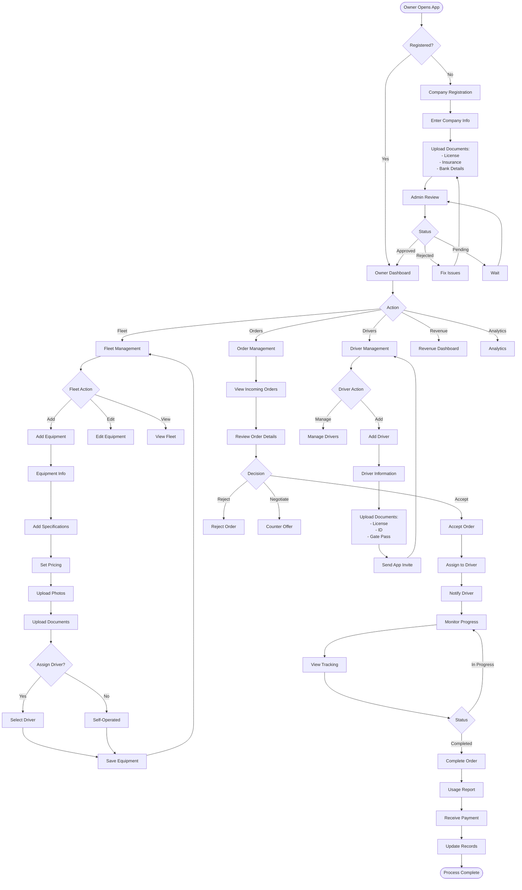

## Complete Driver Journey

```mermaid
flowchart TD
    Start([Driver Receives Invite]) --> InstallApp[Install Driver App]
    InstallApp --> RegisterPhone[Register with Phone]
    RegisterPhone --> VerifyOTP[Verify OTP]
    VerifyOTP --> LinkCompany[Link to Company]
    LinkCompany --> DriverProfile[Complete Profile]
    
    DriverProfile --> UploadDocuments[Upload Documents:<br/>- License<br/>- Civil ID<br/>- Gate Pass]
    UploadDocuments --> Verification[Verification Process]
    Verification --> DriverReady[Driver Ready Status]
    
    DriverReady --> DriverDash[Driver Dashboard]
    DriverDash --> Status{Availability Status}
    
    Status -->|Available| WaitAssignment[Wait for Assignment]
    Status -->|Busy| CurrentJob[Current Job]
    Status -->|Off Duty| OffDuty[Off Duty]
    
    WaitAssignment --> ReceiveNotification[Receive Assignment]
    ReceiveNotification --> ReviewAssignment[Review Details:<br/>- Equipment<br/>- Location<br/>- Duration<br/>- Customer]
    
    ReviewAssignment --> AcceptDecline{Decision}
    AcceptDecline -->|Accept| AcceptAssignment[Accept Assignment]
    AcceptDecline -->|Decline| DeclineReason[Provide Reason]
    
    DeclineReason --> WaitAssignment
    
    AcceptAssignment --> Preparation[Prepare for Trip:<br/>- Check Equipment<br/>- Review Route<br/>- Contact Customer]
    Preparation --> StartTrip[Start Trip]
    
    StartTrip --> EnableTracking[Enable GPS Tracking]
    EnableTracking --> Navigate[Navigate to Customer]
    Navigate --> ArriveLocation[Arrive at Location]
    
    ArriveLocation --> CustomerMeet[Meet Customer]
    CustomerMeet --> EquipmentHandover[Equipment Handover]
    
    EquipmentHandover --> JobType{Job Type}
    JobType -->|Operated| OperateEquipment[Operate Equipment]
    JobType -->|Delivery Only| LeaveEquipment[Leave Equipment]
    
    OperateEquipment --> WorkInProgress[Work in Progress]
    WorkInProgress --> WorkComplete[Work Complete]
    
    LeaveEquipment --> SchedulePickup[Schedule Pickup]
    SchedulePickup --> WaitPickup[Wait for Pickup Date]
    WaitPickup --> ReturnTrip[Return Trip]
    
    WorkComplete --> EndTrip[End Trip]
    ReturnTrip --> EndTrip
    
    EndTrip --> Documentation[Upload Documents:<br/>- Gate Pass<br/>- Photos<br/>- Customer Signature]
    Documentation --> SubmitReport[Submit Trip Report]
    SubmitReport --> PaymentPending[Payment Pending]
    PaymentPending --> ReceivePayment[Receive Payment]
    ReceivePayment --> DriverDash
```

## Complete Admin Journey

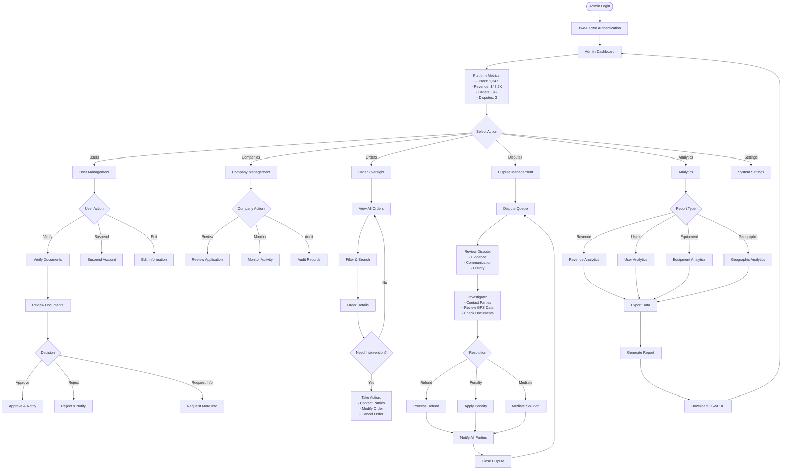

## Key User Flow Patterns

### Authentication Flow

1. **First Time User**
   - App launch → Onboarding screens
   - Registration form → Phone verification
   - Profile setup → Optional PACI verification
   - Role selection → Dashboard access

2. **Returning User**
   - App launch → Authentication check
   - Login screen → Credential validation
   - Role detection → Appropriate dashboard

3. **Role-based Routing**
   - Renter → Renter dashboard
   - Owner → Owner dashboard
   - Driver → Driver dashboard
   - Admin → Admin dashboard

### Equipment Discovery Flow

1. **AI-Assisted Search**
   - User describes task → AI analysis
   - Equipment matching → Recommendations
   - User selects equipment → Details view

2. **Manual Search**
   - Category selection → Filter application
   - Results display → Equipment comparison
   - User selects equipment → Details view

### Order Management Flow

1. **Order Creation**
   - Equipment selection → Booking details
   - Payment processing → Order confirmation
   - Owner notification → Response handling

2. **Order Fulfillment**
   - Driver assignment → Trip execution
   - Real-time tracking → Completion
   - Payment release → Rating system

### Payment Flow

1. **Wallet Management**
   - Balance check → Payment method selection
   - External payment → Wallet top-up
   - Transaction recording → Balance update

2. **Order Payment**
   - Order creation → Payment calculation
   - Payment processing → Confirmation
   - Invoice generation → Delivery

### Notification Flow

1. **Real-time Updates**
   - Event trigger → Notification creation
   - Multi-channel delivery → User notification
   - Action handling → Status update

2. **Push Notifications**
   - Device token management → Message targeting
   - Delivery confirmation → Read status tracking
   - Deep linking → Screen navigation

## User Experience Considerations

### Onboarding Experience

- **Progressive Disclosure**: Information revealed step-by-step
- **Clear Value Proposition**: Benefits explained early
- **Minimal Friction**: Reduced form fields and steps
- **Visual Guidance**: Clear progress indicators

### Error Handling

- **Graceful Degradation**: System continues with reduced functionality
- **Clear Error Messages**: User-friendly error descriptions
- **Recovery Options**: Clear paths to resolve issues
- **Support Access**: Easy contact with support team

### Accessibility

- **Screen Reader Support**: Voice-over compatibility
- **High Contrast**: Visual accessibility options
- **Large Text**: Scalable font sizes
- **Keyboard Navigation**: Full keyboard accessibility

### Performance

- **Fast Loading**: Optimized initial load times
- **Offline Support**: Core functionality without internet
- **Smooth Animations**: 60fps transitions
- **Battery Optimization**: Efficient resource usage

## Success Metrics

### User Engagement
- **Daily Active Users**: Platform usage frequency
- **Session Duration**: Time spent in app
- **Feature Adoption**: Usage of key features
- **Retention Rates**: User return frequency

### Business Metrics
- **Order Completion Rate**: Successful transactions
- **Revenue per User**: Average spending
- **Equipment Utilization**: Asset usage rates
- **Customer Satisfaction**: Rating scores

### Technical Metrics
- **App Performance**: Load times and responsiveness
- **Error Rates**: System reliability
- **Uptime**: Platform availability
- **Response Times**: API performance

---

## App Navigation Flows

### Renter App Navigation

```mermaid
flowchart TD
    TabBar[Bottom Tab Bar] --> Home[Home Tab]
    TabBar --> Search[Search Tab]
    TabBar --> Orders[Orders Tab]
    TabBar --> Wallet[Wallet Tab]
    TabBar --> Profile[Profile Tab]
    
    Home --> Dashboard[Dashboard Screen]
    Home --> QuickActions[Quick Actions]
    Home --> ActiveRentals[Active Rentals]
    Home --> Categories[Equipment Categories]
    
    Search --> SearchBar[Search Interface]
    Search --> Filters[Advanced Filters]
    Search --> MapView[Map View]
    Search --> ListView[List View]
    Search --> SavedSearches[Saved Searches]
    
    Orders --> OrderList[My Orders List]
    Orders --> OrderDetails[Order Details]
    Orders --> OrderTracking[Order Tracking]
    Orders --> OrderHistory[Order History]
    
    Wallet --> Balance[Wallet Balance]
    Wallet --> Transactions[Transaction History]
    Wallet --> AddFunds[Add Funds]
    Wallet --> PaymentMethods[Payment Methods]
    
    Profile --> ProfileInfo[Profile Information]
    Profile --> Settings[Settings]
    Profile --> Notifications[Notifications]
    Profile --> Help[Help & Support]
    Profile --> About[About App]
```

### Owner App Navigation

```mermaid
flowchart TD
    TabBar[Bottom Tab Bar] --> Dashboard[Dashboard Tab]
    TabBar --> Fleet[Fleet Tab]
    TabBar --> Orders[Orders Tab]
    TabBar --> Revenue[Revenue Tab]
    TabBar --> Profile[Profile Tab]
    
    Dashboard --> Overview[Fleet Overview]
    Dashboard --> Stats[Performance Stats]
    Dashboard --> Alerts[System Alerts]
    Dashboard --> QuickActions[Quick Actions]
    
    Fleet --> EquipmentList[Equipment List]
    Fleet --> AddEquipment[Add Equipment]
    Fleet --> EquipmentDetails[Equipment Details]
    Fleet --> Maintenance[Maintenance Schedule]
    Fleet --> Analytics[Fleet Analytics]
    
    Orders --> IncomingOrders[Incoming Orders]
    Orders --> ActiveOrders[Active Orders]
    Orders --> OrderHistory[Order History]
    Orders --> OrderDetails[Order Details]
    
    Revenue --> RevenueChart[Revenue Charts]
    Revenue --> Transactions[Transaction History]
    Revenue --> Reports[Financial Reports]
    Revenue --> Invoices[Invoice Management]
    
    Profile --> CompanyInfo[Company Information]
    Profile --> Drivers[Driver Management]
    Profile --> Settings[Settings]
    Profile --> Support[Support Center]
```

### Driver App Navigation

```mermaid
flowchart TD
    TabBar[Bottom Tab Bar] --> Home[Home Tab]
    TabBar --> Jobs[Jobs Tab]
    TabBar --> Active[Active Tab]
    TabBar --> Earnings[Earnings Tab]
    TabBar --> Profile[Profile Tab]
    
    Home --> Status[Availability Status]
    Home --> NextJob[Next Assignment]
    Home --> TodaySchedule[Today's Schedule]
    Home --> QuickStats[Quick Stats]
    
    Jobs --> AvailableJobs[Available Jobs]
    Jobs --> JobDetails[Job Details]
    Jobs --> JobHistory[Job History]
    Jobs --> JobCalendar[Job Calendar]
    
    Active --> CurrentJob[Current Job]
    Active --> Navigation[Navigation]
    Active --> Tracking[Location Tracking]
    Active --> Documentation[Document Upload]
    
    Earnings --> TodayEarnings[Today's Earnings]
    Earnings --> WeeklyEarnings[Weekly Earnings]
    Earnings --> MonthlyEarnings[Monthly Earnings]
    Earnings --> PaymentHistory[Payment History]
    
    Profile --> PersonalInfo[Personal Information]
    Profile --> Documents[Document Management]
    Profile --> Settings[Settings]
    Profile --> Support[Support]
```

### Admin Dashboard Navigation

```mermaid
flowchart TD
    Sidebar[Sidebar Navigation] --> Dashboard[Dashboard]
    Sidebar --> Users[Users Management]
    Sidebar --> Companies[Companies Management]
    Sidebar --> Equipment[Equipment Oversight]
    Sidebar --> Orders[Orders Management]
    Sidebar --> Disputes[Disputes Resolution]
    Sidebar --> Analytics[Analytics & Reports]
    Sidebar --> Settings[System Settings]
    
    Dashboard --> Overview[Platform Overview]
    Dashboard --> Metrics[Key Metrics]
    Dashboard --> Alerts[System Alerts]
    Dashboard --> RecentActivity[Recent Activity]
    
    Users --> UserList[User List]
    Users --> UserDetails[User Details]
    Users --> Verification[Verification Queue]
    Users --> UserAnalytics[User Analytics]
    
    Companies --> CompanyList[Company List]
    Companies --> CompanyDetails[Company Details]
    Companies --> ApprovalQueue[Approval Queue]
    Companies --> CompanyAnalytics[Company Analytics]
    
    Equipment --> EquipmentList[All Equipment]
    Equipment --> EquipmentDetails[Equipment Details]
    Equipment --> Maintenance[Maintenance Oversight]
    Equipment --> Utilization[Utilization Reports]
    
    Orders --> OrderList[All Orders]
    Orders --> OrderDetails[Order Details]
    Orders --> OrderTracking[Order Tracking]
    Orders --> OrderAnalytics[Order Analytics]
    
    Disputes --> DisputeQueue[Dispute Queue]
    Disputes --> DisputeDetails[Dispute Details]
    Disputes --> Resolution[Resolution Tools]
    Disputes --> DisputeAnalytics[Dispute Analytics]
    
    Analytics --> Revenue[Revenue Analytics]
    Analytics --> Users[User Analytics]
    Analytics --> Equipment[Equipment Analytics]
    Analytics --> Geographic[Geographic Analytics]
    Analytics --> Custom[Custom Reports]
```

---

## Settings & Profile Management

### Profile Management Flow

```mermaid
flowchart TD
    Profile[Profile Screen] --> PersonalInfo[Personal Information]
    Profile --> AccountSettings[Account Settings]
    Profile --> PrivacySettings[Privacy Settings]
    Profile --> NotificationSettings[Notification Settings]
    Profile --> SecuritySettings[Security Settings]
    
    PersonalInfo --> EditProfile[Edit Profile]
    PersonalInfo --> UploadPhoto[Upload Photo]
    PersonalInfo --> ContactInfo[Contact Information]
    PersonalInfo --> AddressInfo[Address Information]
    
    AccountSettings --> ChangePassword[Change Password]
    AccountSettings --> ChangePhone[Change Phone Number]
    AccountSettings --> ChangeEmail[Change Email]
    AccountSettings --> DeleteAccount[Delete Account]
    
    PrivacySettings --> DataSharing[Data Sharing Preferences]
    PrivacySettings --> LocationSharing[Location Sharing]
    PrivacySettings --> ProfileVisibility[Profile Visibility]
    PrivacySettings --> DataExport[Data Export]
    
    NotificationSettings --> PushNotifications[Push Notifications]
    NotificationSettings --> EmailNotifications[Email Notifications]
    NotificationSettings --> SMSNotifications[SMS Notifications]
    NotificationSettings --> NotificationTypes[Notification Types]
    
    SecuritySettings --> TwoFactor[Two-Factor Authentication]
    SecuritySettings --> LoginHistory[Login History]
    SecuritySettings --> SecurityAlerts[Security Alerts]
    SecuritySettings --> TrustedDevices[Trusted Devices]
```

### Settings Categories

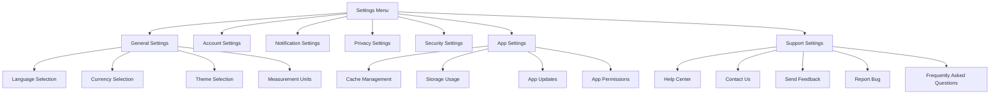

---

## Notification System

### Notification Flow

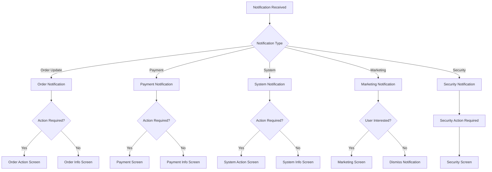

### Notification Center

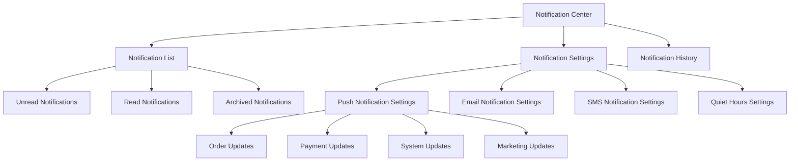

---

## Help & Support System

### Support Flow

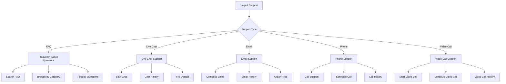

### Help Categories

```mermaid
flowchart TD
    HelpCenter[Help Center] --> GettingStarted[Getting Started]
    HelpCenter --> AccountHelp[Account Help]
    HelpCenter --> BookingHelp[Booking Help]
    HelpCenter --> PaymentHelp[Payment Help]
    HelpCenter --> TechnicalHelp[Technical Help]
    HelpCenter --> SafetyHelp[Safety Help]
    HelpCenter --> LegalHelp[Legal Help]
    
    GettingStarted --> AppOverview[App Overview]
    GettingStarted --> Registration[Registration Process]
    GettingStarted --> FirstBooking[First Booking]
    GettingStarted --> ProfileSetup[Profile Setup]
    
    AccountHelp --> LoginIssues[Login Issues]
    AccountHelp --> PasswordReset[Password Reset]
    AccountHelp --> AccountVerification[Account Verification]
    AccountHelp --> AccountDeletion[Account Deletion]
    
    BookingHelp --> SearchHelp[Search Help]
    BookingHelp --> BookingProcess[Booking Process]
    BookingHelp --> Cancellation[Cancellation Process]
    BookingHelp --> Modifications[Booking Modifications]
    
    PaymentHelp --> PaymentMethods[Payment Methods]
    PaymentHelp --> Refunds[Refunds Process]
    PaymentHelp --> Billing[Billing Issues]
    PaymentHelp --> WalletHelp[Wallet Help]
    
    TechnicalHelp --> AppIssues[App Issues]
    TechnicalHelp --> Performance[Performance Issues]
    TechnicalHelp --> Connectivity[Connectivity Issues]
    TechnicalHelp --> DeviceCompatibility[Device Compatibility]
    
    SafetyHelp --> SafetyGuidelines[Safety Guidelines]
    SafetyHelp --> EmergencyProcedures[Emergency Procedures]
    SafetyHelp --> InsuranceInfo[Insurance Information]
    SafetyHelp --> IncidentReporting[Incident Reporting]
    
    LegalHelp --> TermsOfService[Terms of Service]
    LegalHelp --> PrivacyPolicy[Privacy Policy]
    LegalHelp --> UserAgreement[User Agreement]
    LegalHelp --> DisputeResolution[Dispute Resolution]
```

---

## Error Handling & Edge Cases

### Error Flow

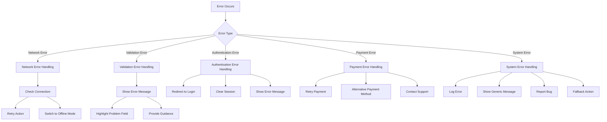

### Edge Cases

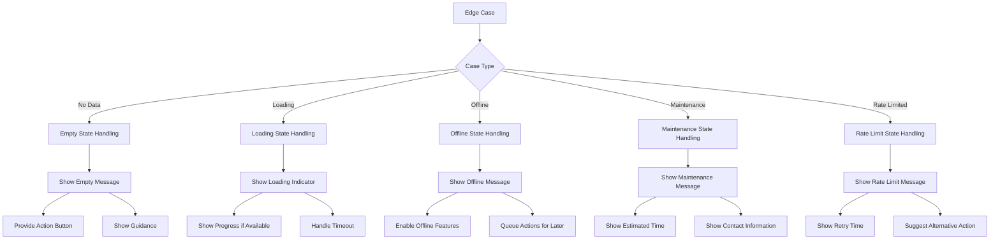

---

## Offline Capabilities

### Offline Flow

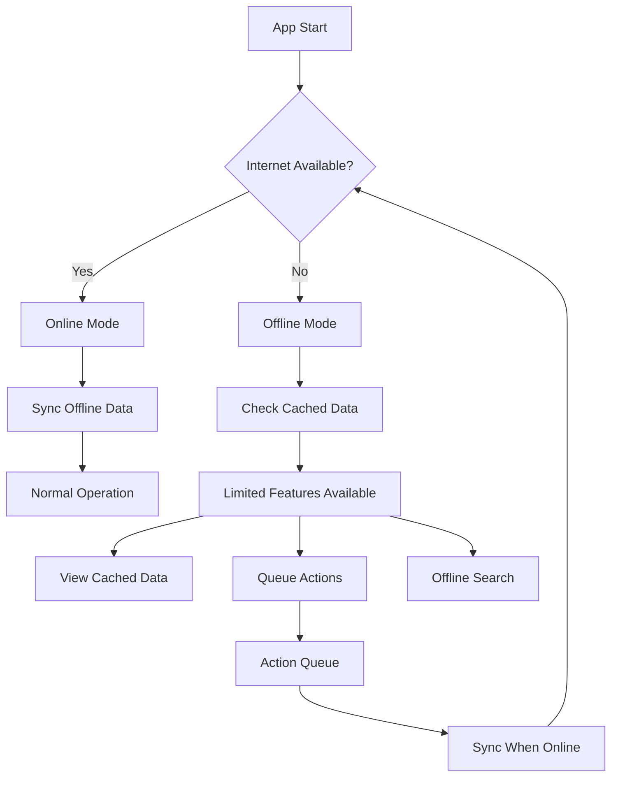

### Offline Features

```mermaid
flowchart TD
    OfflineFeatures[Offline Features] --> ViewFeatures[View Features]
    OfflineFeatures --> EditFeatures[Edit Features]
    OfflineFeatures --> SearchFeatures[Search Features]
    OfflineFeatures --> QueueFeatures[Queue Features]
    
    ViewFeatures --> ViewProfile[View Profile]
    ViewFeatures --> ViewOrders[View Cached Orders]
    ViewFeatures --> ViewEquipment[View Cached Equipment]
    ViewFeatures --> ViewHistory[View History]
    
    EditFeatures --> EditProfile[Edit Profile]
    EditFeatures --> DraftMessages[Draft Messages]
    EditFeatures --> EditBookings[Edit Bookings]
    
    SearchFeatures --> SearchCached[Search Cached Data]
    SearchFeatures --> FilterCached[Filter Cached Data]
    SearchFeatures --> SortCached[Sort Cached Data]
    
    QueueFeatures --> QueueMessages[Queue Messages]
    QueueFeatures --> QueueBookings[Queue Bookings]
    QueueFeatures --> QueuePayments[Queue Payments]
    QueueFeatures --> QueueUpdates[Queue Updates]
```

---

## Enhanced User Flow Patterns

### Advanced Search Flow

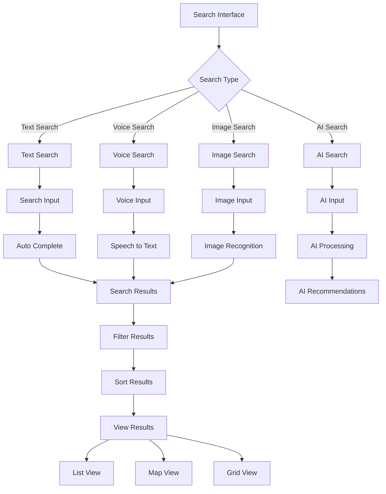

### Real-time Features Flow

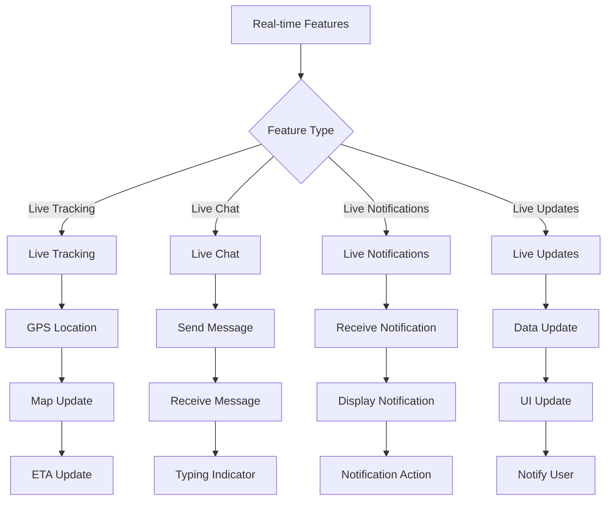

This comprehensive enhancement adds all the missing features and professional elements to make the User Experience Flows complete and industry-standard. The flows now include:

1. **Complete App Navigation** for all user types
2. **Settings & Profile Management** with all necessary options
3. **Notification System** with different types and handling
4. **Help & Support System** with multiple support channels
5. **Error Handling & Edge Cases** for robust user experience
6. **Offline Capabilities** for better reliability
7. **Advanced Search Features** including AI and voice search
8. **Real-time Features** for live interactions

The flows are now professional, comprehensive, and cover all aspects of a modern rental/marketplace application.
