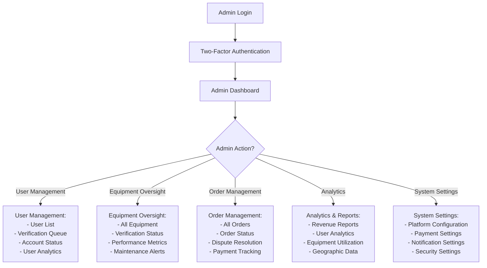

# YARDR - Professional User Experience Flows

## Table of Contents
1. [System Overview & User Roles](#system-overview--user-roles)
2. [YARDR Unified App Journey](#yardr-unified-app-journey)
3. [Equipment Management Flows](#equipment-management-flows)
4. [Order & Booking Management](#order--booking-management)
5. [Payment & Financial Flows](#payment--financial-flows)
6. [AI Assistant & Smart Features](#ai-assistant--smart-features)
7. [Tracking & Delivery System](#tracking--delivery-system)
8. [Admin Dashboard Journey](#admin-dashboard-journey)
9. [Communication & Support](#communication--support)
10. [Settings & Profile Management](#settings--profile-management)
11. [User Experience Considerations](#user-experience-considerations)

## System Overview & User Roles

### Platform Architecture
YARDR is a unified heavy equipment rental platform with two main applications:
- **YARDR App**: Unified app for both individuals and companies
- **Admin Dashboard**: Web-based management interface

### User Roles
1. **Individual Users**: Rent equipment for personal projects
2. **Company Users**: Manage fleet, rent equipment, handle business operations
3. **Administrators**: Platform oversight, user management, dispute resolution

---

## YARDR Unified App Journey

### Initial App Launch & User Type Selection

### Main Dashboard Navigation

## Equipment Management Flows

### Equipment Search & Discovery

### Equipment Registration Flow

## Tracking & Delivery System

### Simple Point-to-Point Tracking

### Driver Management (Company Side)

## Admin Dashboard Journey

### Admin Login & Dashboard

### Equipment Oversight Flow

### Order Management & Dispute Resolution

## Order & Booking Management

### Equipment Booking Flow

### Order Management & Tracking

## Payment & Financial Flows

### Payment Processing

## AI Assistant & Smart Features

### AI-Powered Equipment Recommendations

### Smart Search & Filtering

## Communication & Support

### In-App Communication

### Help & Support System

## Settings & Profile Management

### Profile Management Flow

## User Experience Considerations

### Performance Optimization
- **Fast Loading**: Optimized initial load times < 3 seconds
- **Offline Support**: Core functionality without internet
- **Smooth Animations**: 60fps transitions
- **Battery Optimization**: Efficient resource usage

### Accessibility Features
- **Screen Reader Support**: Voice-over compatibility
- **High Contrast**: Visual accessibility options
- **Large Text**: Scalable font sizes
- **Keyboard Navigation**: Full keyboard accessibility

### Multi-language Support
- **English/Arabic**: Complete language support
- **RTL Layout**: Right-to-left for Arabic
- **Cultural Adaptation**: Localized content and imagery
- **Currency Support**: KWD with international options

### Security Features
- **PACI Verification**: Kuwait Civil ID integration
- **Two-Factor Authentication**: Enhanced security
- **Data Encryption**: End-to-end encryption
- **Privacy Controls**: User data management

### Success Metrics

#### User Engagement
- **Daily Active Users**: Platform usage frequency
- **Session Duration**: Time spent in app
- **Feature Adoption**: Usage of key features
- **Retention Rates**: User return frequency

#### Business Metrics
- **Order Completion Rate**: Successful transactions
- **Revenue per User**: Average spending
- **Equipment Utilization**: Asset usage rates
- **Customer Satisfaction**: Rating scores

#### Technical Metrics
- **App Performance**: Load times and responsiveness
- **Error Rates**: System reliability
- **Uptime**: Platform availability
- **Response Times**: API performance
