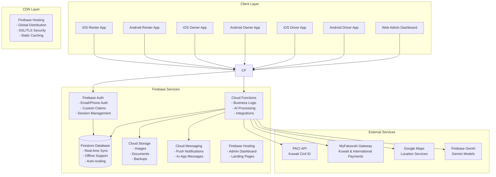
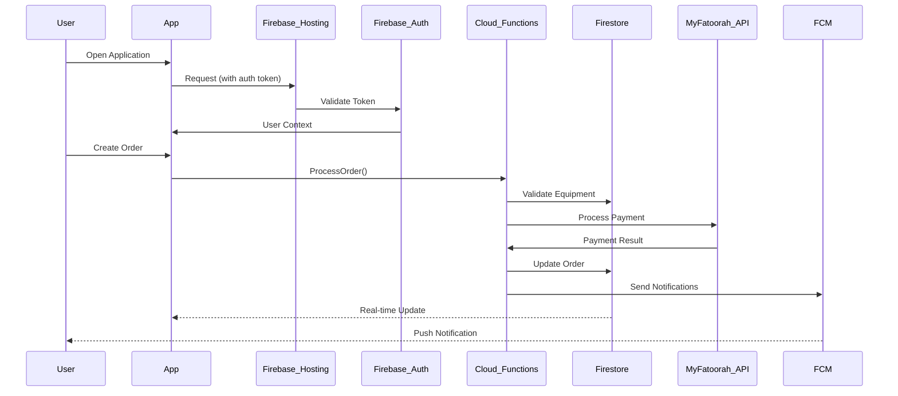
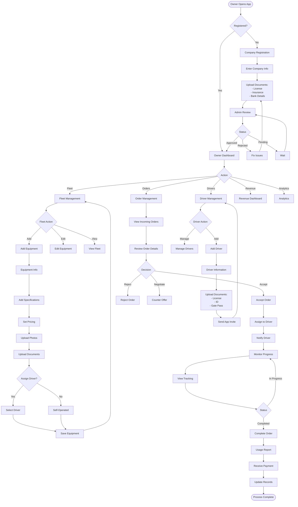
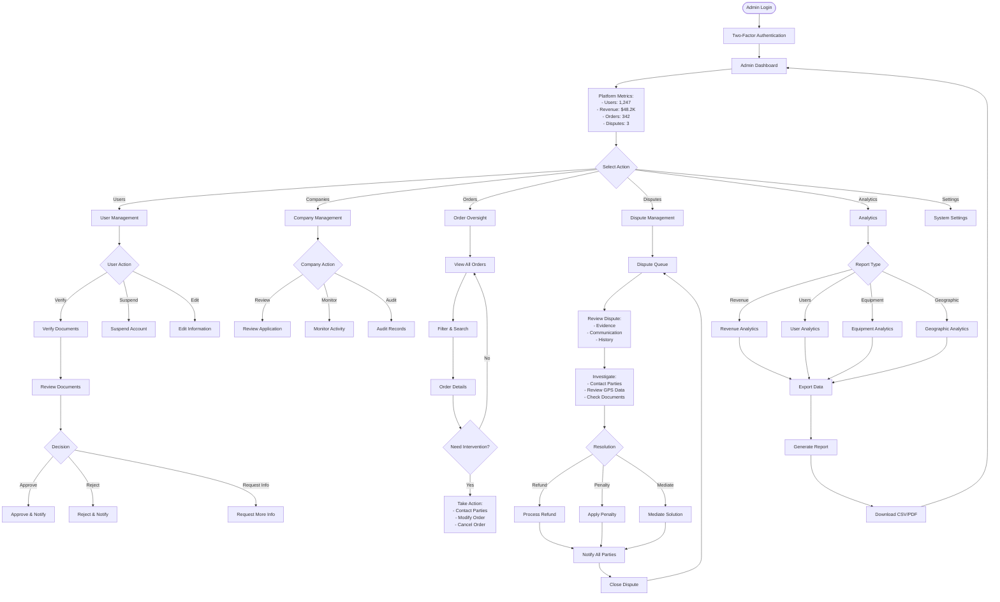

# YARDR - Complete System Documentation & Implementation Guide

## Table of Contents
1. [Project Overview](#project-overview)
2. [Technical Architecture](#technical-architecture)
3. [Firebase Configuration](#firebase-configuration)
4. [Firebase Project Structure](#firebase-project-structure)
5. [User Experience Flows](#user-experience-flows)
6. [Database Schema](#database-schema)
7. [Backend Functions](#backend-functions)
8. [Design System](#design-system)
9. [Third Party Integrations](#third-party-integrations)

---

## 1. Project Overview

YARDR is a comprehensive heavy equipment rental platform serving the Kuwait market. The system connects equipment renters, owners, drivers, and administrators through four dedicated applications, all powered by Firebase backend services.

### Core Innovation: AI Equipment Assistant
Users describe their task/problem in natural language, and the AI recommends suitable equipment with explanations, eliminating the need for technical knowledge.

### Technical Stack
- **Frontend**: Expo (React Native) for iOS/Android apps
- **Backend**: Firebase (Auth, Firestore, Functions, Storage, Messaging)
- **CDN**: Firebase Hosting for global distribution and protection
- **Payments**: MyFatoorah (Kuwait and International)
- **AI**: Firebase GenAI Chatbot extension with Gemini models


---

## 2. Technical Architecture

### 2.1 High-Level Architecture



### 2.2 Data Flow Architecture



---

## 3. Firebase Configuration

### 3.1 Install Firebase GenAI Chatbot Extension

```bash
# Install the Firebase GenAI Chatbot extension
firebase ext:install googlecloud/firestore-genai-chatbot

# Configure the extension
firebase ext:configure googlecloud/firestore-genai-chatbot
```

### 3.2 Extension Configuration

```typescript
// Extension configuration parameters
export const genAIConfig = {
  // Gemini API Provider (google-ai or vertex-ai)
  geminiApiProvider: 'google-ai',
  
  // Gemini Model (gemini-1.5-flash or gemini-1.5-pro)
  geminiModel: 'gemini-1.5-flash',
  
  // Firestore collection path for conversations
  firestoreCollectionPath: 'ai-conversations/{userId}',
  
  // Response field name
  responseField: 'response',
  
  // Timestamp field for ordering
  timestampField: 'createTime',
  
  // AI Assistant context
  context: `You are a heavy equipment rental assistant for YARDR platform in Kuwait. 
  Help users find the right equipment for their construction tasks. 
  Consider local regulations, weather conditions, and project requirements.
  Provide specific equipment recommendations with brief explanations and estimated costs.
  Support both English and Arabic languages.`,
  
  // Model parameters
  temperature: 0.7,
  maxTokens: 500,
  
  // Enable Genkit monitoring
  enableGenkitMonitoring: true
};
```

### 3.3 AI Service Implementation

```typescript
// src/services/ai.ts
import { collection, addDoc, query, orderBy, limit, getDocs, doc, updateDoc } from 'firebase/firestore';
import { db } from '../config/firebase';

export const AIService = {
  async getEquipmentRecommendations(userId: string, userQuery: string, userContext?: any) {
    try {
      // Create conversation document in Firestore
      const conversationRef = collection(db, `ai-conversations/${userId}`);
      
      const messageDoc = await addDoc(conversationRef, {
        prompt: userQuery,
        userContext: userContext || {},
        timestamp: new Date(),
        status: 'PENDING'
      });

      // The Firebase GenAI extension will automatically process this document
      // and add the response field when complete
      
      return {
        messageId: messageDoc.id,
        status: 'processing'
      };
    } catch (error) {
      console.error('AI service error:', error);
      throw new Error('Failed to get AI recommendations');
    }
  },

  async getConversationHistory(userId: string, limitCount: number = 10) {
    try {
      const conversationRef = collection(db, `ai-conversations/${userId}`);
      const q = query(conversationRef, orderBy('createTime', 'desc'), limit(limitCount));
      
      const querySnapshot = await getDocs(q);
      const conversations = querySnapshot.docs.map(doc => ({
        id: doc.id,
        ...doc.data()
      }));

      return conversations.reverse(); // Return in chronological order
    } catch (error) {
      console.error('Get conversation history error:', error);
      throw error;
    }
  }
};
```

## 4. Firebase Project Structure

### 4.1 Project Structure

```
yardr-firebase/
├── .firebaserc
├── firebase.json
├── firestore.rules
├── firestore.indexes.json
├── storage.rules
├── functions/
│   ├── src/
│   │   ├── index.ts
│   │   ├── auth/
│   │   │   ├── onCreate.ts
│   │   │   ├── onDelete.ts
│   │   │   └── customClaims.ts
│   │   ├── orders/
│   │   │   ├── createOrder.ts
│   │   │   ├── updateStatus.ts
│   │   │   ├── matchEquipment.ts
│   │   │   └── assignDriver.ts
│   │   ├── payments/
│   │   │   ├── processPayment.ts
│   │   │   ├── updateWallet.ts
│   │   │   ├── refund.ts
│   │   │   └── generateInvoice.ts
│   │   ├── notifications/
│   │   │   ├── sendPushNotification.ts
│   │   │   ├── sendEmail.ts
│   │   │   └── sendSMS.ts
│   │   ├── ai/
│   │   │   ├── analyzeRequest.ts
│   │   │   ├── recommendEquipment.ts
│   │   │   └── processNLP.ts
│   │   ├── tracking/
│   │   │   ├── updateLocation.ts
│   │   │   ├── calculateRoute.ts
│   │   │   └── generateReport.ts
│   │   └── admin/
│   │       ├── approveUser.ts
│   │       ├── generateAnalytics.ts
│   │       └── resolveDispute.ts
│   ├── package.json
│   └── tsconfig.json
└── client/
    ├── shared/
    │   ├── firebase.config.ts
    │   ├── types.ts
    │   └── utils.ts
    ├── apps/
    │   ├── renter/
    │   ├── owner/
    │   ├── driver/
    │   └── admin/
    └── packages/
        ├── ui-components/
        ├── firebase-hooks/
        └── utils/
```

### 3.2 Firestore Security Rules

```javascript
rules_version = '2';
service cloud.firestore {
  match /databases/{database}/documents {
    
    // Helper functions
    function isAuthenticated() {
      return request.auth != null;
    }
    
    function isOwner(userId) {
      return request.auth.uid == userId;
    }
    
    function hasRole(role) {
      return request.auth.token.role == role;
    }
    
    function isAdmin() {
      return hasRole('admin');
    }
    
    function isVerified() {
      return request.auth.token.verified == true;
    }
    
    // Users collection
    match /users/{userId} {
      allow read: if isAuthenticated();
      allow create: if isOwner(userId);
      allow update: if isOwner(userId) || isAdmin();
      allow delete: if isAdmin();
    }
    
    // Companies collection
    match /companies/{companyId} {
      allow read: if isAuthenticated();
      allow create: if isVerified();
      allow update: if resource.data.ownerId == request.auth.uid || isAdmin();
      allow delete: if isAdmin();
      
      // Company subcollections
      match /drivers/{driverId} {
        allow read: if isAuthenticated();
        allow write: if resource.data.ownerId == request.auth.uid || isAdmin();
      }
    }
    
    // Equipment collection
    match /equipment/{equipmentId} {
      allow read: if true; // Public read for browsing
      allow create: if isVerified() && hasRole('owner');
      allow update: if resource.data.ownerId == request.auth.uid || isAdmin();
      allow delete: if resource.data.ownerId == request.auth.uid || isAdmin();
    }
    
    // Orders collection
    match /orders/{orderId} {
      allow read: if request.auth.uid == resource.data.renterId || 
                     request.auth.uid == resource.data.ownerId ||
                     request.auth.uid == resource.data.driverId ||
                     isAdmin();
      allow create: if isVerified();
      allow update: if request.auth.uid in resource.data.parties || isAdmin();
      allow delete: if isAdmin();
      
      // Order subcollections
      match /tracking/{trackingId} {
        allow read: if request.auth.uid in resource.data.parties || isAdmin();
        allow write: if request.auth.uid == resource.data.driverId || isAdmin();
      }
    }
    
    // Transactions collection
    match /transactions/{transactionId} {
      allow read: if request.auth.uid == resource.data.userId || isAdmin();
      allow create: if false; // Only through Cloud Functions
      allow update: if false; // Only through Cloud Functions
      allow delete: if isAdmin();
    }
    
    // Notifications collection
    match /notifications/{userId}/messages/{messageId} {
      allow read: if isOwner(userId);
      allow create: if false; // Only through Cloud Functions
      allow update: if isOwner(userId); // Mark as read
      allow delete: if isOwner(userId);
    }
    
    // Analytics collection (admin only)
    match /analytics/{document=**} {
      allow read: if isAdmin();
      allow write: if false; // Only through Cloud Functions
    }
  }
}
```

### 3.3 Firebase Configuration

```typescript
// firebase.config.ts
import { initializeApp } from 'firebase/app';
import { getAuth } from 'firebase/auth';
import { getFirestore } from 'firebase/firestore';
import { getFunctions } from 'firebase/functions';
import { getStorage } from 'firebase/storage';
import { getMessaging } from 'firebase/messaging';
import { getAnalytics } from 'firebase/analytics';

const firebaseConfig = {
  apiKey: process.env.FIREBASE_API_KEY,
  authDomain: process.env.FIREBASE_AUTH_DOMAIN,
  projectId: process.env.FIREBASE_PROJECT_ID,
  storageBucket: process.env.FIREBASE_STORAGE_BUCKET,
  messagingSenderId: process.env.FIREBASE_MESSAGING_SENDER_ID,
  appId: process.env.FIREBASE_APP_ID,
  measurementId: process.env.FIREBASE_MEASUREMENT_ID
};

const app = initializeApp(firebaseConfig);

export const auth = getAuth(app);
export const db = getFirestore(app);
export const functions = getFunctions(app);
export const storage = getStorage(app);
export const messaging = getMessaging(app);
export const analytics = getAnalytics(app);

// Enable offline persistence
enableIndexedDbPersistence(db).catch((err) => {
  if (err.code == 'failed-precondition') {
    console.log('Persistence failed: Multiple tabs open');
  } else if (err.code == 'unimplemented') {
    console.log('Persistence not available');
  }
});
```

---

## 5. User Experience Flows

### 4.1 Complete Renter Journey

```mermaid
flowchart TD
    Start([User Opens App]) --> FirstTime{First Time?}
    
    FirstTime -->|Yes| Onboarding[Onboarding Screens]
    FirstTime -->|No| AuthCheck{Authenticated?}
    
    Onboarding --> Registration[Registration]
    Registration --> PhoneVerify[Phone Verification]
    PhoneVerify --> ProfileSetup[Profile Setup]
    ProfileSetup --> PACIOption{PACI Verification?}
    
    PACIOption -->|Yes| PACIFlow[PACI Verification Flow]
    PACIOption -->|No| BasicUser[Basic User Status]
    
    PACIFlow --> TrustedUser[Trusted User Status]
    
    BasicUser --> Dashboard
    TrustedUser --> Dashboard
    AuthCheck -->|Yes| Dashboard
    AuthCheck -->|No| Login[Login Screen]
    Login --> Dashboard[Renter Dashboard]
    
    Dashboard --> Action{User Action}
    
    Action -->|Search| SearchMethod{Search Type}
    Action -->|Orders| OrdersList[My Orders]
    Action -->|Wallet| WalletScreen[Wallet Management]
    Action -->|Profile| ProfileScreen[Profile Settings]
    
    SearchMethod -->|Manual| ManualSearch[Browse Categories]
    SearchMethod -->|AI| AIAssistant[AI Chat Interface]
    
    AIAssistant --> DescribeProblem[Describe Task/Problem]
    DescribeProblem --> AIProcessing[AI Analysis]
    AIProcessing --> Recommendations[Equipment Recommendations]
    Recommendations --> SelectEquipment
    
    ManualSearch --> Filters[Apply Filters]
    Filters --> Results[Search Results]
    Results --> SelectEquipment[Select Equipment]
    
    SelectEquipment --> EquipmentDetails[View Details]
    EquipmentDetails --> CheckAvailability[Check Availability]
    CheckAvailability --> CreateBooking[Create Booking]
    
    CreateBooking --> SpecifyDetails[Specify:<br/>- Location<br/>- Duration<br/>- Services]
    SpecifyDetails --> ReviewOrder[Review Order]
    ReviewOrder --> CheckWallet{Sufficient Balance?}
    
    CheckWallet -->|No| AddFunds[Add Funds]
    CheckWallet -->|Yes| ConfirmOrder[Confirm Order]
    
    AddFunds --> PaymentMethod{Payment Method}
    PaymentMethod -->|MyFatoorah| MyFatoorahFlow[MyFatoorah Payment]
    
    MyFatoorahFlow --> PaymentProcess[Process Payment]
    
    PaymentProcess --> PaymentResult{Result}
    PaymentResult -->|Success| WalletUpdated[Wallet Updated]
    PaymentResult -->|Failed| PaymentError[Error Handling]
    
    PaymentError --> PaymentMethod
    WalletUpdated --> ConfirmOrder
    
    ConfirmOrder --> OrderSubmitted[Order Submitted]
    OrderSubmitted --> WaitingApproval[Waiting for Owner]
    
    WaitingApproval --> OwnerResponse{Owner Response}
    OwnerResponse -->|Accepted| OrderActive[Order Active]
    OwnerResponse -->|Rejected| FindAlternative[Find Alternative]
    
    FindAlternative --> SearchMethod
    
    OrderActive --> TrackOrder[Track Order]
    TrackOrder --> EquipmentDelivered[Equipment Delivered]
    EquipmentDelivered --> UseEquipment[Use Equipment]
    UseEquipment --> RentalComplete[Rental Complete]
    RentalComplete --> RateExperience[Rate & Review]
    RateExperience --> ViewInvoice[View Invoice]
    ViewInvoice --> End([Journey Complete])
```



### 4.2 Complete Owner Journey



### 4.3 Complete Driver Journey

```mermaid
flowchart TD
    Start([Driver Receives Invite]) --> InstallApp[Install Driver App]
    InstallApp --> RegisterPhone[Register with Phone]
    RegisterPhone --> VerifyOTP[Verify OTP]
    VerifyOTP --> LinkCompany[Link to Company]
    LinkCompany --> DriverProfile[Complete Profile]
    
    DriverProfile --> UploadDocuments[Upload Documents:<br/>- License<br/>- Civil ID<br/>- Gate Pass]
    UploadDocuments --> Verification[Verification Process]
    Verification --> DriverReady[Driver Ready Status]
    
    DriverReady --> DriverDash[Driver Dashboard]
    DriverDash --> Status{Availability Status}
    
    Status -->|Available| WaitAssignment[Wait for Assignment]
    Status -->|Busy| CurrentJob[Current Job]
    Status -->|Off Duty| OffDuty[Off Duty]
    
    WaitAssignment --> ReceiveNotification[Receive Assignment]
    ReceiveNotification --> ReviewAssignment[Review Details:<br/>- Equipment<br/>- Location<br/>- Duration<br/>- Customer]
    
    ReviewAssignment --> AcceptDecline{Decision}
    AcceptDecline -->|Accept| AcceptAssignment[Accept Assignment]
    AcceptDecline -->|Decline| DeclineReason[Provide Reason]
    
    DeclineReason --> WaitAssignment
    
    AcceptAssignment --> Preparation[Prepare for Trip:<br/>- Check Equipment<br/>- Review Route<br/>- Contact Customer]
    Preparation --> StartTrip[Start Trip]
    
    StartTrip --> EnableTracking[Enable GPS Tracking]
    EnableTracking --> Navigate[Navigate to Customer]
    Navigate --> ArriveLocation[Arrive at Location]
    
    ArriveLocation --> CustomerMeet[Meet Customer]
    CustomerMeet --> EquipmentHandover[Equipment Handover]
    
    EquipmentHandover --> JobType{Job Type}
    JobType -->|Operated| OperateEquipment[Operate Equipment]
    JobType -->|Delivery Only| LeaveEquipment[Leave Equipment]
    
    OperateEquipment --> WorkInProgress[Work in Progress]
    WorkInProgress --> WorkComplete[Work Complete]
    
    LeaveEquipment --> SchedulePickup[Schedule Pickup]
    SchedulePickup --> WaitPickup[Wait for Pickup Date]
    WaitPickup --> ReturnTrip[Return Trip]
    
    WorkComplete --> EndTrip[End Trip]
    ReturnTrip --> EndTrip
    
    EndTrip --> Documentation[Upload Documents:<br/>- Gate Pass<br/>- Photos<br/>- Customer Signature]
    Documentation --> SubmitReport[Submit Trip Report]
    SubmitReport --> PaymentPending[Payment Pending]
    PaymentPending --> ReceivePayment[Receive Payment]
    ReceivePayment --> DriverDash
```



### 4.4 Complete Admin Journey



---

## 6. Database Schema

### 5.1 Complete Collection Schemas

```typescript
// TypeScript Interfaces for all collections

// Users Collection
interface User {
  uid: string;
  email: string;
  phone: string;
  phoneVerified: boolean;
  displayName: string;
  photoURL?: string;
  role: 'renter' | 'owner' | 'driver' | 'admin';
  companyId?: string; // For owners and drivers
  
  // Verification
  verified: boolean;
  verificationLevel: 'basic' | 'verified' | 'trusted';
  paciVerified?: boolean;
  paciData?: {
    civilId: string;
    fullName: string;
    nationality: string;
    verifiedAt: Timestamp;
  };
  
  // Wallet
  wallet: {
    balance: number;
    currency: 'KWD';
    holdAmount: number;
    lastUpdated: Timestamp;
  };
  
  // Profile
  profile: {
    address?: string;
    city?: string;
    area?: string;
    location?: GeoPoint;
    language: 'en' | 'ar';
    notificationPreferences: {
      push: boolean;
      email: boolean;
      sms: boolean;
    };
  };
  
  // Metadata
  createdAt: Timestamp;
  updatedAt: Timestamp;
  lastActive: Timestamp;
  deviceTokens: string[];
  
  // Stats (for renters)
  renterStats?: {
    totalOrders: number;
    totalSpent: number;
    averageRating: number;
  };
}

// Companies Collection
interface Company {
  id: string;
  ownerId: string;
  type: 'individual' | 'company';
  
  // Company Details
  details: {
    name: string;
    commercialLicense?: string;
    taxId?: string;
    address: string;
    city: string;
    phone: string;
    email: string;
    website?: string;
    logo?: string;
  };
  
  // Verification
  verification: {
    status: 'pending' | 'approved' | 'rejected';
    documents: {
      type: string;
      url: string;
      uploadedAt: Timestamp;
      verifiedAt?: Timestamp;
    }[];
    rejectionReason?: string;
    verifiedBy?: string;
  };
  
  // Banking
  banking: {
    bankName: string;
    accountName: string;
    accountNumber: string;
    iban: string;
    swiftCode?: string;
  };
  
  // Stats
  stats: {
    totalEquipment: number;
    totalDrivers: number;
    totalOrders: number;
    totalRevenue: number;
    averageRating: number;
    completionRate: number;
  };
  
  // Settings
  settings: {
    autoAcceptOrders: boolean;
    minimumOrderValue: number;
    operatingHours: {
      [key: string]: { open: string; close: string; };
    };
    serviceAreas: string[];
  };
  
  createdAt: Timestamp;
  updatedAt: Timestamp;
  active: boolean;
}

// Equipment Collection
interface Equipment {
  id: string;
  ownerId: string;
  companyId: string;
  
  // Basic Info
  basic: {
    name: string;
    category: 'earthmoving' | 'lifting' | 'concrete' | 'compaction' | 'hauling' | 'specialized';
    type: string; // e.g., 'excavator', 'crane', 'bulldozer'
    brand: string;
    model: string;
    year: number;
    serialNumber?: string;
    registrationNumber: string;
    registrationExpiry: Timestamp;
  };
  
  // Specifications
  specs: {
    capacity: string; // e.g., "20 tons", "50m reach"
    enginePower?: string;
    fuelType?: 'diesel' | 'electric' | 'hybrid';
    dimensions?: {
      length: number;
      width: number;
      height: number;
      weight: number;
    };
    attachments?: string[];
    features?: string[];
  };
  
  // Availability
  availability: {
    status: 'available' | 'rented' | 'maintenance' | 'unavailable';
    calendar: {
      [date: string]: 'available' | 'booked' | 'maintenance';
    };
    nextAvailable?: Timestamp;
    location: GeoPoint;
    serviceRadius: number; // in km
  };
  
  // Pricing
  pricing: {
    hourly: number;
    daily: number;
    weekly: number;
    monthly: number;
    mobilization?: number; // delivery/pickup fee
    operator?: number; // operator fee if applicable
    currency: 'KWD';
    negotiable: boolean;
  };
  
  // Media
  media: {
    photos: string[];
    primaryPhoto: string;
    documents: {
      type: 'insurance' | 'registration' | 'inspection';
      url: string;
      expiryDate?: Timestamp;
    }[];
    videos?: string[];
  };
  
  // Operator/Driver
  operator: {
    required: boolean;
    assigned?: string; // driverId
    selfOperated: boolean;
  };
  
  // Maintenance
  maintenance: {
    lastService: Timestamp;
    nextService: Timestamp;
    hoursUsed: number;
    condition: 'excellent' | 'good' | 'fair';
    history: {
      date: Timestamp;
      type: string;
      description: string;
      cost: number;
    }[];
  };
  
  // Stats
  stats: {
    totalOrders: number;
    totalRevenue: number;
    totalHours: number;
    averageRating: number;
    utilizationRate: number;
  };
  
  // Search
  searchKeywords: string[];
  
  createdAt: Timestamp;
  updatedAt: Timestamp;
  active: boolean;
  featured: boolean;
}

// Orders Collection
interface Order {
  id: string;
  orderNumber: string; // Human-readable
  
  // Parties
  parties: {
    renterId: string;
    renterName: string;
    renterPhone: string;
    ownerId: string;
    ownerName: string;
    ownerPhone: string;
    companyId: string;
    driverId?: string;
    driverName?: string;
    driverPhone?: string;
  };
  
  // Equipment
  equipment: {
    id: string;
    name: string;
    type: string;
    dailyRate: number;
    hourlyRate: number;
  };
  
  // Rental Details
  rental: {
    startDate: Timestamp;
    endDate: Timestamp;
    duration: number; // in days
    location: {
      address: string;
      coordinates: GeoPoint;
      instructions?: string;
    };
    purpose?: string;
    withOperator: boolean;
    needsDelivery: boolean;
  };
  
  // Status
  status: {
    current: 'draft' | 'pending' | 'accepted' | 'rejected' | 'paid' | 'active' | 
             'in_progress' | 'completed' | 'cancelled' | 'disputed';
    history: {
      status: string;
      timestamp: Timestamp;
      by: string;
      note?: string;
    }[];
  };
  
  // Pricing
  pricing: {
    equipmentCost: number;
    operatorCost?: number;
    deliveryCost?: number;
    subtotal: number;
    tax: number;
    discount?: number;
    total: number;
    currency: 'KWD';
    paid: boolean;
    paymentMethod?: 'wallet' | 'myfatoorah';
  };
  
  // Payment
  payment: {
    status: 'pending' | 'holding' | 'paid' | 'refunded';
    transactionId?: string;
    paidAt?: Timestamp;
    refundedAt?: Timestamp;
    refundAmount?: number;
    invoiceUrl?: string;
  };
  
  // Tracking
  tracking?: {
    started: boolean;
    startTime?: Timestamp;
    endTime?: Timestamp;
    currentLocation?: GeoPoint;
    route?: GeoPoint[];
    totalDistance?: number;
    actualHours?: number;
  };
  
  // Documents
  documents: {
    gatePass?: string[];
    deliveryPhotos?: string[];
    completionPhotos?: string[];
    customerSignature?: string;
    invoice?: string;
  };
  
  // Rating
  rating?: {
    byRenter?: {
      score: number;
      comment?: string;
      timestamp: Timestamp;
    };
    byOwner?: {
      score: number;
      comment?: string;
      timestamp: Timestamp;
    };
  };
  
  // Dispute
  dispute?: {
    raised: boolean;
    raisedBy: string;
    reason: string;
    description: string;
    evidence?: string[];
    status: 'open' | 'investigating' | 'resolved';
    resolution?: string;
    resolvedBy?: string;
    resolvedAt?: Timestamp;
  };
  
  // AI Assisted
  aiAssisted: boolean;
  aiRecommendation?: {
    problemDescription: string;
    recommendedEquipment: string[];
    confidence: number;
  };
  
  createdAt: Timestamp;
  updatedAt: Timestamp;
}

// Drivers Collection
interface Driver {
  id: string;
  userId: string;
  companyId: string;
  
  // Personal Info
  personal: {
    fullName: string;
    phone: string;
    email?: string;
    civilId: string;
    nationality: string;
    dateOfBirth: Timestamp;
    photo?: string;
  };
  
  // License
  license: {
    number: string;
    type: string[];
    issueDate: Timestamp;
    expiryDate: Timestamp;
    documentUrl: string;
  };
  
  // Documents
  documents: {
    civilIdCopy: string;
    gatePass?: string;
    safetyTraining?: string;
    medicalCertificate?: string;
  };
  
  // Status
  status: {
    current: 'available' | 'busy' | 'off_duty';
    verified: boolean;
    active: boolean;
  };
  
  // Current Assignment
  currentAssignment?: {
    orderId: string;
    equipmentId: string;
    startTime: Timestamp;
    expectedEndTime: Timestamp;
  };
  
  // Stats
  stats: {
    totalTrips: number;
    totalHours: number;
    averageRating: number;
    completionRate: number;
    earnings: number;
  };
  
  // Settings
  settings: {
    notifications: boolean;
    shareLocation: boolean;
    language: 'en' | 'ar';
  };
  
  createdAt: Timestamp;
  updatedAt: Timestamp;
}

// Transactions Collection
interface Transaction {
  id: string;
  type: 'credit' | 'debit' | 'hold' | 'release' | 'refund';
  
  // Parties
  userId: string;
  orderId?: string;
  
  // Amount
  amount: number;
  currency: 'KWD';
  
  // Details
  details: {
    description: string;
    method?: 'wallet' | 'myfatoorah' | 'bank';
    reference?: string;
    gatewayResponse?: any;
  };
  
  // Balance
  balanceBefore: number;
  balanceAfter: number;
  
  // Status
  status: 'pending' | 'processing' | 'completed' | 'failed';
  
  createdAt: Timestamp;
  processedAt?: Timestamp;
}

// Notifications Collection
interface Notification {
  id: string;
  userId: string;
  
  // Content
  title: string;
  body: string;
  data?: any;
  
  // Type
  type: 'order' | 'payment' | 'system' | 'reminder' | 'marketing';
  priority: 'high' | 'normal' | 'low';
  
  // Delivery
  channels: ('push' | 'email' | 'sms')[];
  
  // Status
  read: boolean;
  readAt?: Timestamp;
  
  // Action
  action?: {
    type: string;
    payload: any;
  };
  
  createdAt: Timestamp;
  expiresAt?: Timestamp;
}

// Analytics Collection
interface Analytics {
  id: string;
  date: string; // YYYY-MM-DD
  
  // Platform Metrics
  platform: {
    totalUsers: number;
    newUsers: number;
    activeUsers: number;
    totalOrders: number;
    completedOrders: number;
    cancelledOrders: number;
    totalRevenue: number;
    platformFees: number;
  };
  
  // User Metrics
  users: {
    byRole: {
      renters: number;
      owners: number;
      drivers: number;
    };
    byVerification: {
      basic: number;
      verified: number;
      trusted: number;
    };
  };
  
  // Equipment Metrics
  equipment: {
    total: number;
    available: number;
    rented: number;
    byCategory: { [key: string]: number };
    utilizationRate: number;
  };
  
  // Geographic Metrics
  geographic: {
    ordersByCity: { [key: string]: number };
    revenueByCity: { [key: string]: number };
  };
  
  // AI Metrics
  ai: {
    totalRequests: number;
    successfulMatches: number;
    conversionRate: number;
  };
  
  createdAt: Timestamp;
}
```

---

## 7. Backend Functions

### 6.1 Authentication Functions

```typescript
// auth/onCreate.ts
export const onUserCreate = functions.auth.user().onCreate(async (user) => {
  // 1. Create user profile in Firestore
  const userProfile = {
    uid: user.uid,
    email: user.email,
    phone: user.phoneNumber,
    phoneVerified: false,
    role: 'renter', // default role
    verified: false,
    verificationLevel: 'basic',
    wallet: {
      balance: 0,
      currency: 'KWD',
      holdAmount: 0,
      lastUpdated: admin.firestore.FieldValue.serverTimestamp()
    },
    profile: {
      language: 'en',
      notificationPreferences: {
        push: true,
        email: true,
        sms: true
      }
    },
    createdAt: admin.firestore.FieldValue.serverTimestamp(),
    updatedAt: admin.firestore.FieldValue.serverTimestamp()
  };
  
  await admin.firestore().collection('users').doc(user.uid).set(userProfile);
  
  // 2. Send welcome notification
  await sendWelcomeEmail(user.email);
  
  // 3. Log analytics event
  await logAnalyticsEvent('user_signup', { userId: user.uid });
  
  return { success: true };
});

// auth/customClaims.ts
export const setUserRole = functions.https.onCall(async (data, context) => {
  // Verify admin
  if (!context.auth || !context.auth.token.admin) {
    throw new functions.https.HttpsError('permission-denied', 'Must be admin');
  }
  
  const { userId, role } = data;
  
  // Set custom claims
  await admin.auth().setCustomUserClaims(userId, { role, verified: true });
  
  // Update Firestore
  await admin.firestore().collection('users').doc(userId).update({
    role,
    verified: true,
    updatedAt: admin.firestore.FieldValue.serverTimestamp()
  });
  
  return { success: true };
});
```

### 6.2 Order Management Functions

```typescript
// orders/createOrder.ts
export const createOrder = functions.https.onCall(async (data, context) => {
  // 1. Validate authentication
  if (!context.auth) {
    throw new functions.https.HttpsError('unauthenticated', 'User must be authenticated');
  }
  
  const { equipmentId, startDate, endDate, location, withOperator, needsDelivery } = data;
  
  // 2. Validate equipment availability
  const equipmentDoc = await admin.firestore()
    .collection('equipment')
    .doc(equipmentId)
    .get();
    
  if (!equipmentDoc.exists) {
    throw new functions.https.HttpsError('not-found', 'Equipment not found');
  }
  
  const equipment = equipmentDoc.data();
  
  // 3. Check availability for dates
  const isAvailable = await checkEquipmentAvailability(equipmentId, startDate, endDate);
  if (!isAvailable) {
    throw new functions.https.HttpsError('unavailable', 'Equipment not available for selected dates');
  }
  
  // 4. Calculate pricing
  const duration = calculateDays(startDate, endDate);
  const equipmentCost = equipment.pricing.daily * duration;
  const operatorCost = withOperator ? (equipment.pricing.operator || 0) * duration : 0;
  const deliveryCost = needsDelivery ? (equipment.pricing.mobilization || 0) : 0;
  const subtotal = equipmentCost + operatorCost + deliveryCost;
  const tax = subtotal * 0.05; // 5% tax
  const total = subtotal + tax;
  
  // 5. Create order
  const orderData = {
    orderNumber: generateOrderNumber(),
    parties: {
      renterId: context.auth.uid,
      ownerId: equipment.ownerId,
      companyId: equipment.companyId
    },
    equipment: {
      id: equipmentId,
      name: equipment.basic.name,
      type: equipment.basic.type,
      dailyRate: equipment.pricing.daily
    },
    rental: {
      startDate,
      endDate,
      duration,
      location,
      withOperator,
      needsDelivery
    },
    status: {
      current: 'pending',
      history: [{
        status: 'pending',
        timestamp: admin.firestore.FieldValue.serverTimestamp(),
        by: context.auth.uid,
        note: 'Order created'
      }]
    },
    pricing: {
      equipmentCost,
      operatorCost,
      deliveryCost,
      subtotal,
      tax,
      total,
      currency: 'KWD',
      paid: false
    },
    payment: {
      status: 'pending'
    },
    aiAssisted: data.aiAssisted || false,
    createdAt: admin.firestore.FieldValue.serverTimestamp(),
    updatedAt: admin.firestore.FieldValue.serverTimestamp()
  };
  
  const orderRef = await admin.firestore().collection('orders').add(orderData);
  
  // 6. Send notifications
  await sendOrderNotification(equipment.ownerId, 'new_order', {
    orderId: orderRef.id,
    equipmentName: equipment.basic.name,
    dates: `${startDate} - ${endDate}`,
    total
  });
  
  // 7. Update equipment calendar
  await updateEquipmentCalendar(equipmentId, startDate, endDate, 'tentative');
  
  return { 
    success: true, 
    orderId: orderRef.id,
    total
  };
});

// orders/matchEquipment.ts
export const matchEquipmentToOrder = functions.firestore
  .document('orders/{orderId}')
  .onCreate(async (snapshot, context) => {
    const order = snapshot.data();
    
    // Find alternative equipment if primary is rejected
    if (order.status.current === 'rejected') {
      const alternatives = await findAlternativeEquipment(
        order.equipment.type,
        order.rental.location,
        order.rental.startDate,
        order.rental.endDate
      );
      
      if (alternatives.length > 0) {
        // Notify renter of alternatives
        await sendAlternativeOptionsNotification(order.parties.renterId, alternatives);
      }
    }
  });

// orders/updateStatus.ts
export const updateOrderStatus = functions.https.onCall(async (data, context) => {
  const { orderId, newStatus, note } = data;
  
  // Get order
  const orderRef = admin.firestore().collection('orders').doc(orderId);
  const orderDoc = await orderRef.get();
  
  if (!orderDoc.exists) {
    throw new functions.https.HttpsError('not-found', 'Order not found');
  }
  
  const order = orderDoc.data();
  
  // Validate status transition
  const validTransitions = {
    'pending': ['accepted', 'rejected'],
    'accepted': ['paid', 'cancelled'],
    'paid': ['active', 'cancelled'],
    'active': ['in_progress', 'cancelled'],
    'in_progress': ['completed', 'disputed'],
    'completed': ['disputed']
  };
  
  if (!validTransitions[order.status.current]?.includes(newStatus)) {
    throw new functions.https.HttpsError('invalid-argument', 'Invalid status transition');
  }
  
  // Update status
  await orderRef.update({
    'status.current': newStatus,
    'status.history': admin.firestore.FieldValue.arrayUnion({
      status: newStatus,
      timestamp: admin.firestore.FieldValue.serverTimestamp(),
      by: context.auth.uid,
      note
    }),
    updatedAt: admin.firestore.FieldValue.serverTimestamp()
  });
  
  // Handle status-specific actions
  switch (newStatus) {
    case 'accepted':
      await handleOrderAccepted(orderId, order);
      break;
    case 'paid':
      await handleOrderPaid(orderId, order);
      break;
    case 'active':
      await handleOrderActive(orderId, order);
      break;
    case 'completed':
      await handleOrderCompleted(orderId, order);
      break;
    case 'cancelled':
      await handleOrderCancelled(orderId, order);
      break;
    case 'disputed':
      await handleOrderDisputed(orderId, order);
      break;
  }
  
  return { success: true };
});
```

### 6.3 Payment Functions

```typescript
// payments/processPayment.ts
export const processPayment = functions.https.onCall(async (data, context) => {
  const { orderId, paymentMethod, paymentDetails } = data;
  
  // Get order
  const orderDoc = await admin.firestore()
    .collection('orders')
    .doc(orderId)
    .get();
    
  const order = orderDoc.data();
  
  // Get user wallet
  const userDoc = await admin.firestore()
    .collection('users')
    .doc(context.auth.uid)
    .get();
    
  const user = userDoc.data();
  
  let transactionId: string;
  
  // Process payment based on method
  switch (paymentMethod) {
    case 'wallet':
      // Check wallet balance
      if (user.wallet.balance < order.pricing.total) {
        throw new functions.https.HttpsError('failed-precondition', 'Insufficient wallet balance');
      }
      
      // Deduct from wallet
      transactionId = await processWalletPayment(context.auth.uid, order.pricing.total, orderId);
      break;
      
    case 'myfatoorah':
      // Process MyFatoorah payment
      transactionId = await processMyFatoorahPayment(paymentDetails, order.pricing.total);
      break;
  }
  
  // Update order payment status
  await admin.firestore().collection('orders').doc(orderId).update({
    'payment.status': 'paid',
    'payment.transactionId': transactionId,
    'payment.paidAt': admin.firestore.FieldValue.serverTimestamp(),
    'status.current': 'paid'
  });
  
  // Generate invoice
  const invoiceUrl = await generateInvoice(orderId);
  
  // Send notifications
  await sendPaymentConfirmation(context.auth.uid, orderId, invoiceUrl);
  
  return { 
    success: true, 
    transactionId,
    invoiceUrl 
  };
});

// payments/updateWallet.ts
export const addFundsToWallet = functions.https.onCall(async (data, context) => {
  const { amount, paymentMethod, paymentDetails } = data;
  
  let transactionId: string;
  
  // Process payment
  switch (paymentMethod) {
    case 'myfatoorah':
      transactionId = await processMyFatoorahPayment(paymentDetails, amount);
      break;
  }
  
  // Update wallet
  await admin.firestore().collection('users').doc(context.auth.uid).update({
    'wallet.balance': admin.firestore.FieldValue.increment(amount),
    'wallet.lastUpdated': admin.firestore.FieldValue.serverTimestamp()
  });
  
  // Create transaction record
  await admin.firestore().collection('transactions').add({
    type: 'credit',
    userId: context.auth.uid,
    amount,
    currency: 'KWD',
    details: {
      description: 'Wallet top-up',
      method: paymentMethod,
      reference: transactionId
    },
    status: 'completed',
    createdAt: admin.firestore.FieldValue.serverTimestamp()
  });
  
  return { success: true, transactionId };
});
```

### 6.4 AI Assistant Functions

```typescript
// ai/analyzeRequest.ts
export const analyzeEquipmentRequest = functions.https.onCall(async (data, context) => {
  const { problemDescription, language = 'en' } = data;
  
  // 1. Process natural language input
  const nlpResult = await processNaturalLanguage(problemDescription, language);
  
  // 2. Extract requirements
  const requirements = {
    taskType: nlpResult.taskType, // digging, lifting, moving, etc.
    specifications: {
      depth: nlpResult.entities.depth,
      weight: nlpResult.entities.weight,
      distance: nlpResult.entities.distance,
      area: nlpResult.entities.area,
      height: nlpResult.entities.height
    },
    constraints: {
      space: nlpResult.entities.spaceConstraints,
      time: nlpResult.entities.timeConstraints,
      terrain: nlpResult.entities.terrain
    }
  };
  
  // 3. Match requirements to equipment
  const matches = await findMatchingEquipment(requirements);
  
  // 4. Rank by suitability
  const rankedMatches = rankEquipmentMatches(matches, requirements);
  
  // 5. Generate explanations
  const recommendations = rankedMatches.slice(0, 5).map(match => ({
    equipmentId: match.id,
    name: match.basic.name,
    type: match.basic.type,
    suitabilityScore: match.score,
    explanation: generateExplanation(match, requirements),
    specifications: match.specs,
    pricing: match.pricing,
    availability: match.availability.status
  }));
  
  // 6. Store analysis for learning
  await storeAIAnalysis(problemDescription, requirements, recommendations);
  
  return {
    success: true,
    requirements,
    recommendations,
    confidence: calculateConfidence(recommendations)
  };
});

// ai/processNLP.ts
async function processNaturalLanguage(text: string, language: string) {
  // Use Google Cloud Natural Language API
  const client = new language.LanguageServiceClient();
  
  const document = {
    content: text,
    type: 'PLAIN_TEXT',
    language
  };
  
  // Analyze entities
  const [entities] = await client.analyzeEntities({ document });
  
  // Analyze syntax
  const [syntax] = await client.analyzeSyntax({ document });
  
  // Extract task type from verbs
  const taskType = extractTaskType(syntax.tokens);
  
  // Extract measurements and specifications
  const specifications = extractSpecifications(entities.entities);
  
  return {
    taskType,
    entities: specifications,
    confidence: entities.entities[0]?.salience || 0
  };
}

// ai/recommendEquipment.ts
function generateExplanation(equipment: any, requirements: any): string {
  const explanations = [];
  
  // Match task type
  if (requirements.taskType === 'digging' && equipment.basic.type === 'excavator') {
    explanations.push(`This excavator is ideal for digging tasks`);
  }
  
  // Match specifications
  if (requirements.specifications.depth && equipment.specs.maxDepth >= requirements.specifications.depth) {
    explanations.push(`Can dig up to ${equipment.specs.maxDepth}m deep, meeting your ${requirements.specifications.depth}m requirement`);
  }
  
  if (requirements.specifications.weight && equipment.specs.capacity >= requirements.specifications.weight) {
    explanations.push(`Has ${equipment.specs.capacity} ton capacity, sufficient for your ${requirements.specifications.weight} ton load`);
  }
  
  // Add more explanation logic...
  
  return explanations.join('. ');
}
```

### 6.5 Tracking Functions

```typescript
// tracking/updateLocation.ts
export const updateDriverLocation = functions.https.onCall(async (data, context) => {
  const { orderId, location, timestamp } = data;
  
  // Verify driver
  const orderDoc = await admin.firestore()
    .collection('orders')
    .doc(orderId)
    .get();
    
  if (orderDoc.data().parties.driverId !== context.auth.uid) {
    throw new functions.https.HttpsError('permission-denied', 'Not authorized driver');
  }
  
  // Update tracking subcollection
  await admin.firestore()
    .collection('orders')
    .doc(orderId)
    .collection('tracking')
    .add({
      location: new admin.firestore.GeoPoint(location.latitude, location.longitude),
      timestamp,
      speed: data.speed,
      heading: data.heading
    });
  
  // Update current location in order
  await admin.firestore()
    .collection('orders')
    .doc(orderId)
    .update({
      'tracking.currentLocation': new admin.firestore.GeoPoint(location.latitude, location.longitude),
      'tracking.lastUpdate': timestamp
    });
  
  return { success: true };
});

// tracking/generateReport.ts
export const generateTripReport = functions.https.onCall(async (data, context) => {
  const { orderId } = data;
  
  // Get tracking data
  const trackingSnapshot = await admin.firestore()
    .collection('orders')
    .doc(orderId)
    .collection('tracking')
    .orderBy('timestamp')
    .get();
  
  const trackingPoints = trackingSnapshot.docs.map(doc => doc.data());
  
  // Calculate metrics
  const totalDistance = calculateTotalDistance(trackingPoints);
  const totalTime = calculateTotalTime(trackingPoints);
  const averageSpeed = totalDistance / totalTime;
  
  // Generate report
  const report = {
    orderId,
    startLocation: trackingPoints[0]?.location,
    endLocation: trackingPoints[trackingPoints.length - 1]?.location,
    totalDistance,
    totalTime,
    averageSpeed,
    route: trackingPoints.map(p => p.location),
    generatedAt: admin.firestore.FieldValue.serverTimestamp()
  };
  
  // Store report
  await admin.firestore()
    .collection('orders')
    .doc(orderId)
    .update({
      'tracking.report': report
    });
  
  return report;
});
```

### 6.6 Admin Functions

```typescript
// admin/approveUser.ts
export const approveUserVerification = functions.https.onCall(async (data, context) => {
  // Check admin role
  if (!context.auth.token.admin) {
    throw new functions.https.HttpsError('permission-denied', 'Admin only');
  }
  
  const { userId, verificationType, approved, reason } = data;
  
  if (approved) {
    // Update user verification
    await admin.firestore().collection('users').doc(userId).update({
      verified: true,
      verificationLevel: verificationType,
      'verification.approvedAt': admin.firestore.FieldValue.serverTimestamp(),
      'verification.approvedBy': context.auth.uid
    });
    
    // Set custom claims
    await admin.auth().setCustomUserClaims(userId, { 
      verified: true,
      verificationLevel: verificationType
    });
    
    // Send approval notification
    await sendNotification(userId, 'verification_approved', {
      title: 'Verification Approved',
      body: 'Your account has been verified. You can now access all features.'
    });
  } else {
    // Reject with reason
    await admin.firestore().collection('users').doc(userId).update({
      'verification.rejected': true,
      'verification.rejectionReason': reason,
      'verification.rejectedAt': admin.firestore.FieldValue.serverTimestamp()
    });
    
    // Send rejection notification
    await sendNotification(userId, 'verification_rejected', {
      title: 'Verification Failed',
      body: `Your verification was rejected: ${reason}`
    });
  }
  
  return { success: true };
});

// admin/generateAnalytics.ts
export const generateDailyAnalytics = functions.pubsub
  .schedule('every day 00:00')
  .timeZone('Asia/Kuwait')
  .onRun(async (context) => {
    const yesterday = new Date();
    yesterday.setDate(yesterday.getDate() - 1);
    const dateString = yesterday.toISOString().split('T')[0];
    
    // Aggregate metrics
    const metrics = await aggregateDailyMetrics(dateString);
    
    // Store analytics
    await admin.firestore()
      .collection('analytics')
      .doc(dateString)
      .set({
        date: dateString,
        platform: metrics.platform,
        users: metrics.users,
        equipment: metrics.equipment,
        geographic: metrics.geographic,
        ai: metrics.ai,
        createdAt: admin.firestore.FieldValue.serverTimestamp()
      });
    
    // Send daily report to admins
    await sendDailyReportToAdmins(metrics);
    
    return null;
  });

// admin/resolveDispute.ts
export const resolveDispute = functions.https.onCall(async (data, context) => {
  if (!context.auth.token.admin) {
    throw new functions.https.HttpsError('permission-denied', 'Admin only');
  }
  
  const { orderId, resolution, refundAmount } = data;
  
  // Update dispute status
  await admin.firestore().collection('orders').doc(orderId).update({
    'dispute.status': 'resolved',
    'dispute.resolution': resolution,
    'dispute.resolvedBy': context.auth.uid,
    'dispute.resolvedAt': admin.firestore.FieldValue.serverTimestamp()
  });
  
  // Process refund if applicable
  if (refundAmount > 0) {
    await processRefund(orderId, refundAmount);
  }
  
  // Notify parties
  const order = await admin.firestore().collection('orders').doc(orderId).get();
  const orderData = order.data();
  
  await sendNotification(orderData.parties.renterId, 'dispute_resolved', {
    title: 'Dispute Resolved',
    body: `Your dispute has been resolved: ${resolution}`
  });
  
  await sendNotification(orderData.parties.ownerId, 'dispute_resolved', {
    title: 'Dispute Resolved',
    body: `The dispute has been resolved: ${resolution}`
  });
  
  return { success: true };
});
```

---

## 8. Design System

### 7.1 Design Principles

#### Platform-Specific Guidelines

**iOS (Liquid Glass UI)**
- Translucent backgrounds with blur effects
- Smooth, spring-based animations
- SF Symbols for icons
- Large, readable typography
- Depth through layering
- Natural gestures

**Android (Material Design 3)**
- Dynamic color theming
- Material You personalization
- Elevated surfaces
- Ripple effects
- FAB for primary actions
- Bottom app bars

**Web (ShadCN)**
- Clean, modern interface
- Responsive grid system
- Consistent spacing
- Accessible components
- Keyboard navigation
- Dark mode support

### 7.2 Color System

```typescript
// colors.ts
export const colors = {
  // Primary Colors
  primary: {
    50: '#E6F3FF',
    100: '#CCE7FF',
    200: '#99CFFF',
    300: '#66B7FF',
    400: '#339FFF',
    500: '#0087FF', // Main
    600: '#006FCC',
    700: '#005799',
    800: '#003F66',
    900: '#002733'
  },
  
  // Secondary Colors
  secondary: {
    50: '#F0FDF4',
    100: '#DCFCE7',
    200: '#BBF7D0',
    300: '#86EFAC',
    400: '#4ADE80',
    500: '#22C55E', // Main
    600: '#16A34A',
    700: '#15803D',
    800: '#166534',
    900: '#14532D'
  },
  
  // Semantic Colors
  success: '#10B981',
  warning: '#F59E0B',
  error: '#EF4444',
  info: '#3B82F6',
  
  // Neutral Colors
  neutral: {
    50: '#FAFAFA',
    100: '#F5F5F5',
    200: '#E5E5E5',
    300: '#D4D4D4',
    400: '#A3A3A3',
    500: '#737373',
    600: '#525252',
    700: '#404040',
    800: '#262626',
    900: '#171717'
  },
  
  // Role-Specific Colors
  roles: {
    renter: '#0087FF',
    owner: '#22C55E',
    driver: '#F59E0B',
    admin: '#8B5CF6'
  }
};
```

### 7.3 Typography System

```typescript
// typography.ts
export const typography = {
  // iOS (SF Pro)
  ios: {
    largeTitle: {
      fontFamily: 'SF Pro Display',
      fontSize: 34,
      fontWeight: '700',
      lineHeight: 41
    },
    title1: {
      fontFamily: 'SF Pro Display',
      fontSize: 28,
      fontWeight: '700',
      lineHeight: 34
    },
    title2: {
      fontFamily: 'SF Pro Display',
      fontSize: 22,
      fontWeight: '700',
      lineHeight: 28
    },
    title3: {
      fontFamily: 'SF Pro Display',
      fontSize: 20,
      fontWeight: '600',
      lineHeight: 25
    },
    headline: {
      fontFamily: 'SF Pro Text',
      fontSize: 17,
      fontWeight: '600',
      lineHeight: 22
    },
    body: {
      fontFamily: 'SF Pro Text',
      fontSize: 17,
      fontWeight: '400',
      lineHeight: 22
    },
    callout: {
      fontFamily: 'SF Pro Text',
      fontSize: 16,
      fontWeight: '400',
      lineHeight: 21
    },
    subheadline: {
      fontFamily: 'SF Pro Text',
      fontSize: 15,
      fontWeight: '400',
      lineHeight: 20
    },
    footnote: {
      fontFamily: 'SF Pro Text',
      fontSize: 13,
      fontWeight: '400',
      lineHeight: 18
    },
    caption1: {
      fontFamily: 'SF Pro Text',
      fontSize: 12,
      fontWeight: '400',
      lineHeight: 16
    },
    caption2: {
      fontFamily: 'SF Pro Text',
      fontSize: 11,
      fontWeight: '400',
      lineHeight: 13
    }
  },
  
  // Android (Roboto)
  android: {
    displayLarge: {
      fontFamily: 'Roboto',
      fontSize: 57,
      fontWeight: '400',
      lineHeight: 64
    },
    displayMedium: {
      fontFamily: 'Roboto',
      fontSize: 45,
      fontWeight: '400',
      lineHeight: 52
    },
    displaySmall: {
      fontFamily: 'Roboto',
      fontSize: 36,
      fontWeight: '400',
      lineHeight: 44
    },
    headlineLarge: {
      fontFamily: 'Roboto',
      fontSize: 32,
      fontWeight: '400',
      lineHeight: 40
    },
    headlineMedium: {
      fontFamily: 'Roboto',
      fontSize: 28,
      fontWeight: '400',
      lineHeight: 36
    },
    headlineSmall: {
      fontFamily: 'Roboto',
      fontSize: 24,
      fontWeight: '400',
      lineHeight: 32
    },
    titleLarge: {
      fontFamily: 'Roboto',
      fontSize: 22,
      fontWeight: '500',
      lineHeight: 28
    },
    titleMedium: {
      fontFamily: 'Roboto',
      fontSize: 16,
      fontWeight: '500',
      lineHeight: 24
    },
    titleSmall: {
      fontFamily: 'Roboto',
      fontSize: 14,
      fontWeight: '500',
      lineHeight: 20
    },
    bodyLarge: {
      fontFamily: 'Roboto',
      fontSize: 16,
      fontWeight: '400',
      lineHeight: 24
    },
    bodyMedium: {
      fontFamily: 'Roboto',
      fontSize: 14,
      fontWeight: '400',
      lineHeight: 20
    },
    bodySmall: {
      fontFamily: 'Roboto',
      fontSize: 12,
      fontWeight: '400',
      lineHeight: 16
    },
    labelLarge: {
      fontFamily: 'Roboto',
      fontSize: 14,
      fontWeight: '500',
      lineHeight: 20
    },
    labelMedium: {
      fontFamily: 'Roboto',
      fontSize: 12,
      fontWeight: '500',
      lineHeight: 16
    },
    labelSmall: {
      fontFamily: 'Roboto',
      fontSize: 11,
      fontWeight: '500',
      lineHeight: 16
    }
  }
};
```

### 7.4 Component Library

```typescript
// Common Components Structure

// Button Component
interface ButtonProps {
  variant: 'primary' | 'secondary' | 'outline' | 'ghost' | 'danger';
  size: 'small' | 'medium' | 'large';
  fullWidth?: boolean;
  loading?: boolean;
  disabled?: boolean;
  icon?: React.ReactNode;
  children: React.ReactNode;
  onPress: () => void;
}

// Card Component
interface CardProps {
  variant: 'elevated' | 'outlined' | 'filled';
  padding: 'none' | 'small' | 'medium' | 'large';
  children: React.ReactNode;
}

// Input Component
interface InputProps {
  label: string;
  placeholder?: string;
  value: string;
  onChangeText: (text: string) => void;
  type: 'text' | 'email' | 'phone' | 'number' | 'password';
  error?: string;
  helperText?: string;
  leftIcon?: React.ReactNode;
  rightIcon?: React.ReactNode;
}

// Equipment Card Component
interface EquipmentCardProps {
  equipment: Equipment;
  variant: 'compact' | 'detailed' | 'list';
  onPress: () => void;
  showPrice?: boolean;
  showAvailability?: boolean;
  showRating?: boolean;
}

// Order Card Component
interface OrderCardProps {
  order: Order;
  variant: 'pending' | 'active' | 'completed';
  showActions?: boolean;
  onAction?: (action: string) => void;
}
```

---

## 9. Third Party Integrations

*[See the separate Integration Specifications file for complete details]*

This section covers all third-party integrations including MyFatoorah payments, Google Maps, Firebase GenAI, FCM notifications, and PACI verification.

---

*This comprehensive documentation provides everything needed to build the complete YARDR platform. Each section includes detailed specifications and implementation guidance for the required functionality.*
